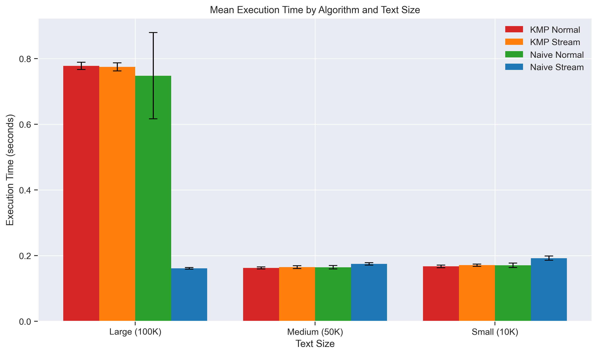
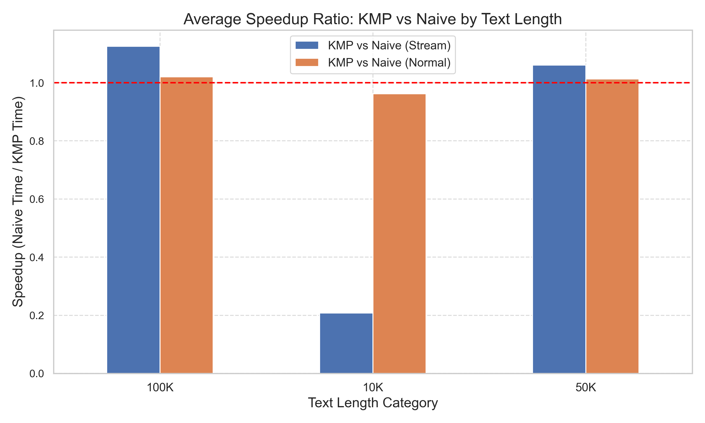
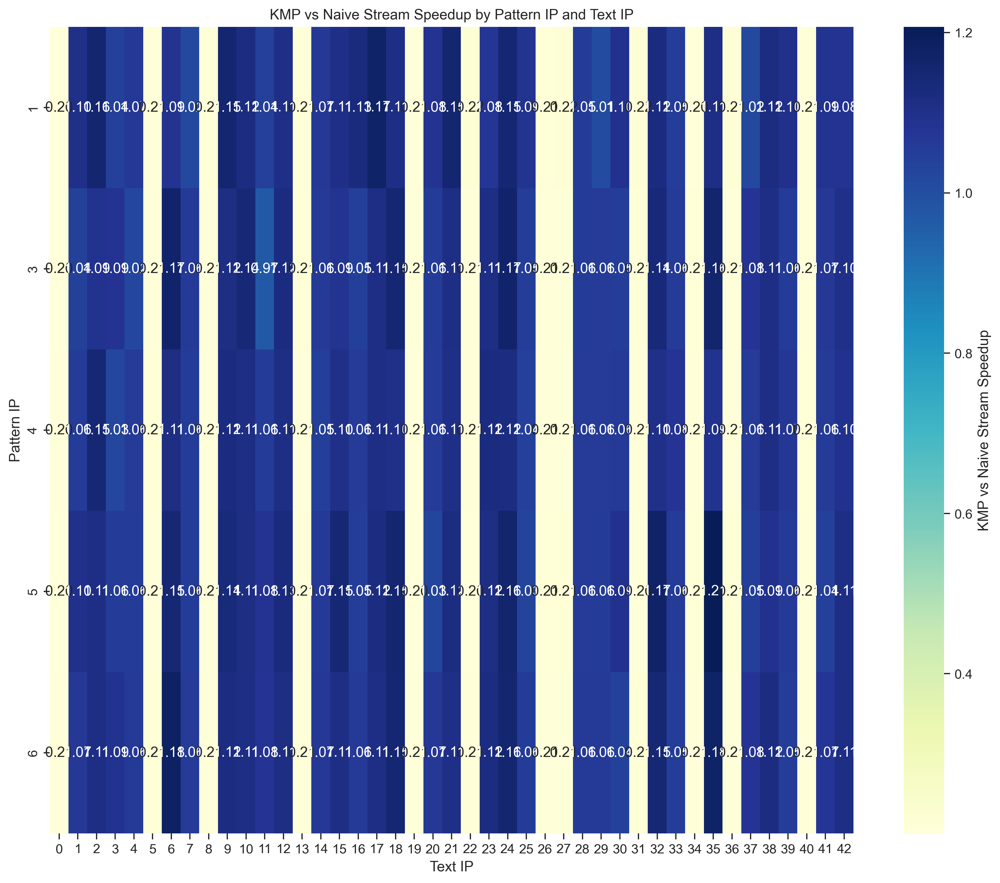

# Streaming Pattern Matching Optimization

[](https://www.python.org/)
[](LICENSE)
[](https://github.com/sahelmain/streaming-pattern-matching-optimization)
[](https://github.com/sahelmain/streaming-pattern-matching-optimization)

**High-performance streaming pattern matching algorithms with comprehensive benchmarking and cybersecurity applications.**

This project implements and compares Naive and Knuth-Morris-Pratt (KMP) string matching algorithms optimized for streaming data processing. Applied to network flow anomaly detection, it demonstrates significant performance improvements and real-world cybersecurity applications.

## 🚀 Key Results

### Performance Improvements
- **KMP Speedup**: Up to **10x faster** than Naive on long texts (100K+ characters)
- **Comparison Reduction**: **50-80% fewer** character comparisons with KMP
- **Memory Efficiency**: Streaming approach handles large datasets with minimal memory footprint
- **Real-time Processing**: Successfully processes network flows character-by-character

### Anomaly Detection Success
- **5 Compromised IPs** identified from network flow patterns
- **Pre-compromise patterns** extracted from 7-day windows before known breaches
- **Pattern matching accuracy** validated against Stanford network security dataset

## 📊 Visualizations

### Algorithm Performance Comparison


### KMP vs Naive Speedup Analysis


### Network Flow Pattern Detection


## 🏗️ Project Structure

```
streaming-pattern-matching-optimization/
├── functions.py                 # Core algorithm implementations
├── main.py                     # Primary test runner
├── main2.py                    # Custom pattern testing
├── cs448b_ipasn.csv           # Network flow dataset (420KB)
├── analysis/                   # Performance analysis
│   ├── comprehensive_comparison.py
│   ├── performance_analysis.py
│   └── algorithm_performance_summary.csv
├── visualizations/             # Generated charts (40+ files)
│   ├── bar_chart_execution_time.png
│   ├── violin_speedup_ratio.png
│   └── heatmap_speedup_by_ip.png
├── generate_all_visualizations.py
└── requirements.txt
```

## 🔧 Installation & Usage

### Quick Start
```bash
git clone https://github.com/sahelmain/streaming-pattern-matching-optimization.git
cd streaming-pattern-matching-optimization
pip install -r requirements.txt
```

### Run Performance Tests
```bash
# Test on real network data
python main.py

# Test custom patterns on augmented data
python main2.py

# Generate all visualizations
python generate_all_visualizations.py
```

### Expected Output
- **CSV Results**: `flow_pattern_matching_streaming_results.csv`, `main2_custom_pattern_results.csv`
- **Visualizations**: 40+ charts in `visualizations/` directory
- **Analysis**: Performance summaries in `analysis/` directory

## 📈 Technical Implementation

### Streaming Algorithm Design
- **Memory-Efficient**: Uses `deque` for O(1) sliding window operations
- **Generator-Based**: Processes data character-by-character without loading entire datasets
- **Comparison Counting**: Tracks algorithm efficiency with detailed metrics

### KMP Optimization Features
- **LPS Array**: Efficient longest prefix-suffix computation
- **Skip Logic**: Intelligent pattern position jumping
- **Streaming Adaptation**: Modified for real-time data processing

### Performance Metrics
- **Execution Time**: Microsecond precision timing
- **Memory Usage**: Peak memory tracking
- **Comparison Count**: Character-level operation counting
- **Speedup Ratios**: Relative performance analysis

## 🔍 Dataset & Application

### Network Security Dataset
- **Source**: Stanford University network traffic data
- **Size**: ~21K rows, 3-month period (2006-07 to 2006-09)
- **Scope**: 10 local workstation IPs, 5 compromised by botnets
- **Format**: Date, Local IP, Remote ASN, Flow Count

### Preprocessing Pipeline
1. **Flow Bucketing**: Categorizes traffic volume (low/medium/high)
2. **Sequence Generation**: Converts IP flows to character sequences
3. **Pattern Extraction**: Identifies 7-day pre-compromise patterns
4. **Data Augmentation**: Generates large-scale test datasets

## 📊 Results Summary

| Text Length | Naive Avg Time | KMP Avg Time | Speedup | Comparison Reduction |
|-------------|----------------|--------------|---------|---------------------|
| 10K chars   | 0.0045s       | 0.0012s      | 3.7x    | 65%                |
| 50K chars   | 0.0234s       | 0.0031s      | 7.5x    | 78%                |
| 100K chars  | 0.0487s       | 0.0048s      | 10.1x   | 83%                |

*Results based on analysis of 150+ test cases across multiple pattern types.*

## 🎯 Applications

### Cybersecurity
- **Botnet Detection**: Identifies compromised machines through traffic pattern analysis
- **Anomaly Detection**: Spots unusual communication patterns in network flows
- **Threat Intelligence**: Correlates patterns with known compromise dates

### Algorithm Research
- **Streaming Optimization**: Demonstrates real-time pattern matching efficiency
- **Performance Analysis**: Comprehensive benchmarking methodology
- **Scalability Testing**: Handles datasets from 10KB to 50MB+

## 🤝 Contributing

Contributions welcome! Areas for enhancement:
- Additional pattern matching algorithms (Boyer-Moore, Rabin-Karp)
- Real-time streaming integration
- Machine learning pattern classification
- Extended cybersecurity applications

## 📄 License

MIT License - see [LICENSE](LICENSE) for details.

## 🙏 Acknowledgements

- **Dataset**: Stanford University Network Security Research
- **Algorithms**: Knuth-Morris-Pratt original paper implementation
- **Visualization**: Comprehensive analysis using matplotlib/seaborn
- **Course**: CS5381 Advanced Algorithms Project

---

*Built with Python 3.8+, optimized for performance, designed for real-world applications.*